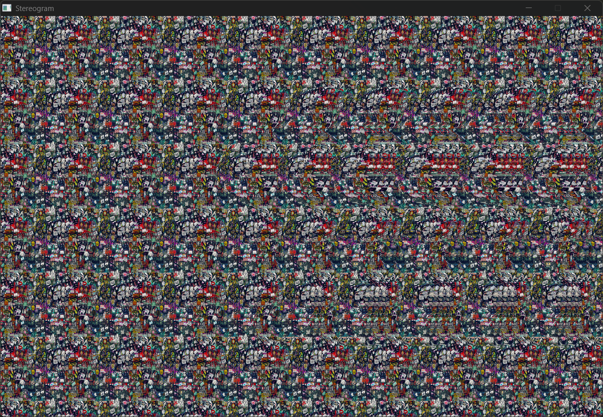
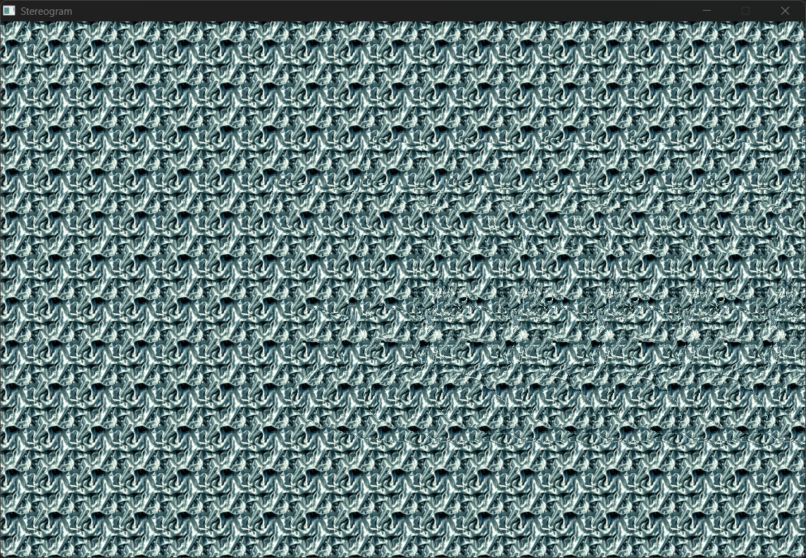
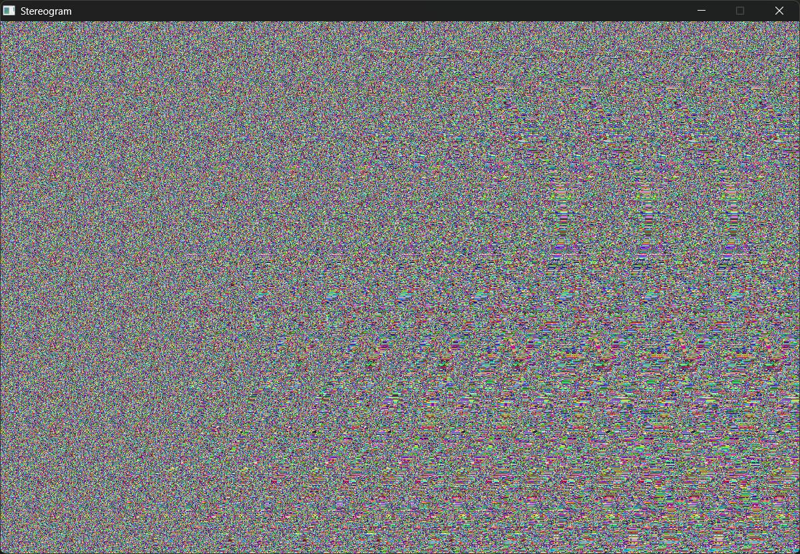

# Autostereograms

An image that creates the illusion of a 3D scene!

If you've never seen one, [see here](https://hidden3d.com/howto-view-stereograms/) for how to view them. 

# Program controls

up/down arrows: change background color texture

left/right arrows: change depth map texture

plus/minus: change offset value maximum (default max 30 pixels)

escape: exit

# Some examples

